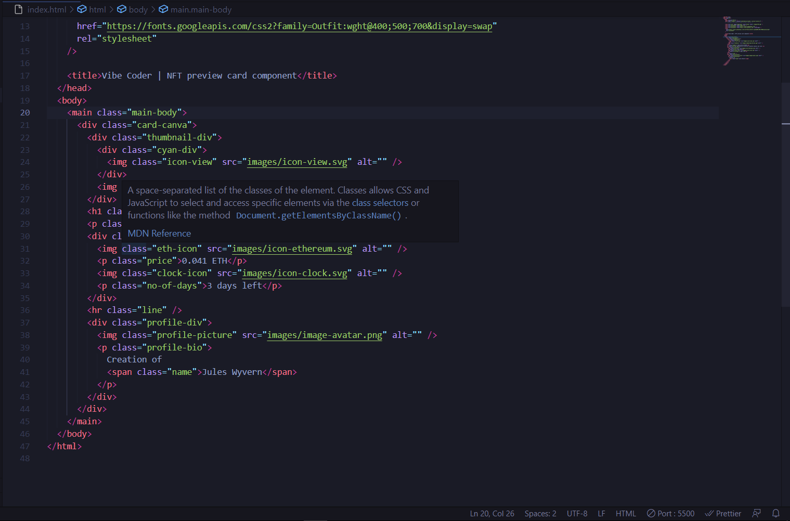
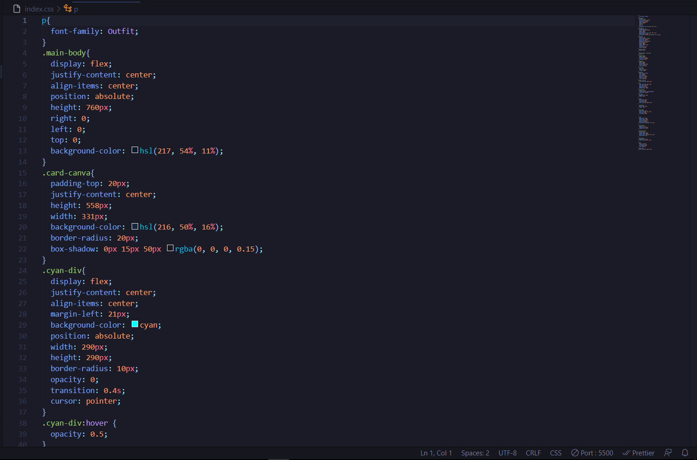

# Frontend Mentor - NFT preview card component solution

This is a solution to the [NFT preview card component challenge on Frontend Mentor](https://www.frontendmentor.io/challenges/nft-preview-card-component-SbdUL_w0U). Frontend Mentor challenges help you improve your coding skills by building realistic projects.

## Table of contents

- [Overview](#overview)
  - [The challenge](#the-challenge)
  - [Screenshot](#screenshot)
  - [Links](#links)
- [My process](#my-process)
  - [Built with](#built-with)
- [Author](#author)
- [Acknowledgments](#acknowledgments)

**Note: Delete this note and update the table of contents based on what sections you keep.**

## Overview

### The challenge

Users should be able to:

- View the optimal layout depending on their device's screen size
- See hover states for interactive elements

### Screenshot

### Links

- Solution URL: [Add solution URL here](https://github.com/vibe-coder/nft-preview-card-component-main/blob/main/index.html)
- Solution URL: [Add solution URL here](https://github.com/vibe-coder/nft-preview-card-component-main/blob/main/index.css)
- Live Site URL: [Add live site URL here](https://tangerine-gaufre-66e4e0.netlify.app/)

## My process

### Built with

- Semantic HTML5 markup
- CSS custom properties
- Flexbox
- Desktop-first workflow

## Author

- Website - [vibe-coder](https://github.com/vibe-coder)
- Frontend Mentor - [@vibe-coder](https://www.frontendmentor.io/profile/TheRealWalker-creator)
- Twitter - [@vibe_coder](https://twitter.com/vibe_coder)

## Acknowledgments

Shoutout to Supersimple-dev. His tutotial on HTML and CSS is awesome.

Shoutout to codercoder. Her tutorial on Github really helped me.

**Note: Delete this note and edit this section's content as necessary. If you completed this challenge by yourself, feel free to delete this section entirely.**
